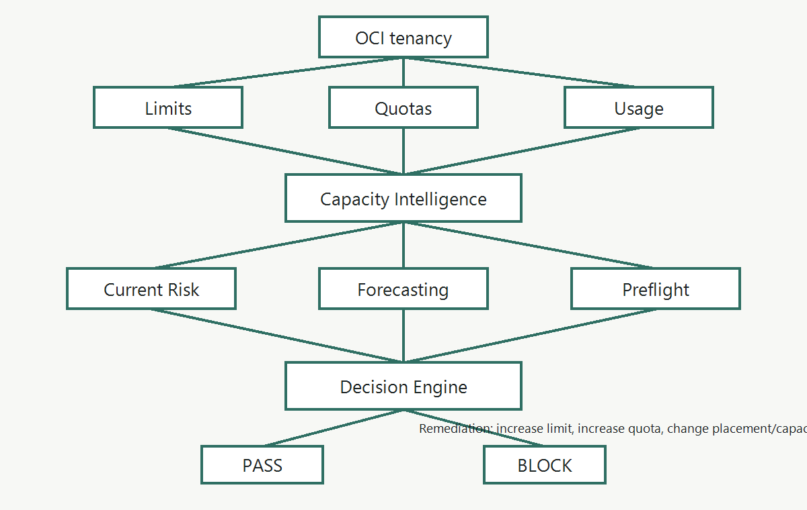
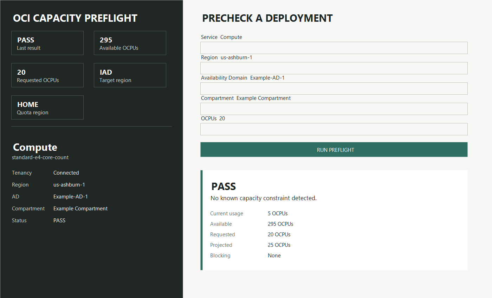
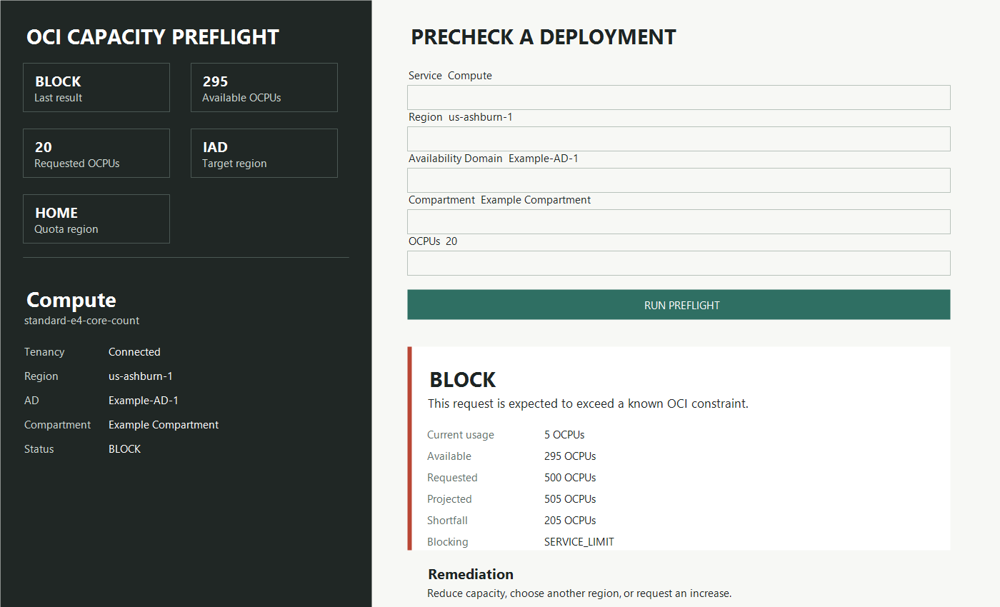
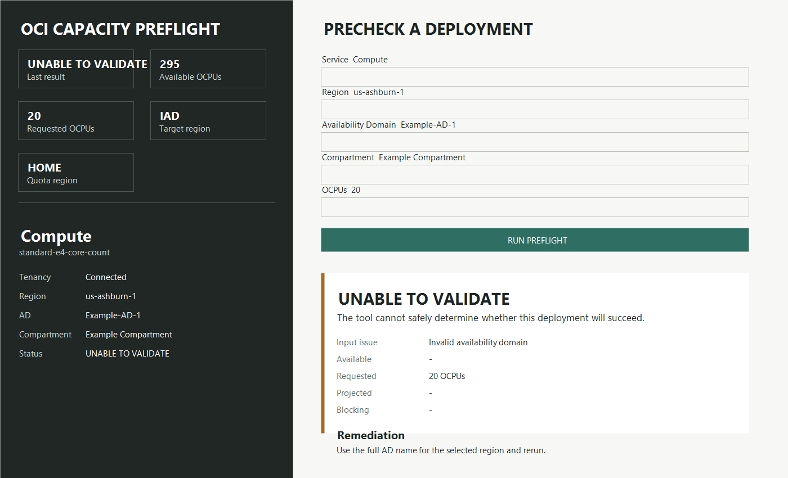

# OCI Capacity Preflight

OCI Capacity Preflight is a customer-deployed reference implementation that answers one operational question before provisioning: will this planned OCI operation fit within the effective capacity available to the tenancy, compartment, region, and availability domain?

It is not another Limits, Quotas, or Usage dashboard. Those signals are inputs. Preflight is the decision layer on top.

## Value Proposition

OCI Capacity Preflight helps customers catch capacity, service-limit, and quota issues before Terraform, CI/CD, or application provisioning starts. It turns live OCI limit/quota signals into a deployment readiness decision:

```text
PASS / BLOCK / Unable To Validate
```

The customer sees current usage, available capacity, requested capacity, projected usage, blocking constraint, and remediation guidance.

## Screenshots

Architecture:



PASS:



BLOCK:



Unable To Validate:



Customer value: the service-limit CSV/export workflow answers "what are my limits and how do they compare?" OCI Capacity Preflight answers "will this planned deployment fit before I deploy?" The two workflows are complementary.

| Capability             | Answers                                                          |
| ---------------------- | ---------------------------------------------------------------- |
| Usage                  | What am I consuming now?                                         |
| Limits                 | What is my maximum capacity?                                     |
| Quotas                 | What am I allowed to consume in this scope?                      |
| OCI Capacity Preflight | Will my planned operation fit within all applicable constraints? |

Example:

```text
Limit:
80

Usage:
72

Quota:
20

Quota usage:
18

Planned operation:
14
```

Limit says 8 service-level units remain. Quota says 2 compartment-level units remain. Preflight says `BLOCK`: the operation requires 14, but effective available capacity is 2.

## Demo

```bash
python -m cli.main preflight --demo quota --requested-ocpus 14
python -m cli.main preflight --demo pass --requested-ocpus 8
python -m cli.main risk
python -m cli.main forecast
```

`BLOCK` exits with code `2`; `UNKNOWN` exits with code `3`.

## Required Scenarios

### Quota Blocks First

```text
PRECHECK: BLOCK

Planned operation:
Add 14 OCPUs in us-phoenix-1

Effective available capacity:
2 OCPUs

Reason:
The target compartment has a quota of 20 OCPUs and is currently using 18.

The requested 14 OCPUs would exceed the compartment quota.

Additional service-level capacity:
8 OCPUs

Recommended actions:
1. Increase the compartment quota.
2. Deploy into another eligible compartment.
3. Reduce the requested capacity.

Service-limit increase:
Not required for this failure.
```

### Service Limit Blocks

```text
PRECHECK: BLOCK

Current service usage: 72
Service limit: 80
Available: 8
Requested: 14
Projected: 86

Reason:
Projected usage exceeds the Compute service limit by 6 OCPUs.

Recommended action:
Request a service limit increase to at least 86 OCPUs.
```

### Everything Fits

```text
PRECHECK: PASS

Current usage: 72
Service limit: 100
Quota available: 20
Requested: 8

Projected service usage: 80
Projected quota usage: 16

No known capacity constraint detected.
```

## Advisory Result

A successful preflight reduces avoidable capacity failures but cannot guarantee that the subsequent OCI operation will succeed. The actual OCI service remains authoritative, and another operation can consume capacity after preflight.

## OCI APIs

Service limits use OCI Limits APIs: `ListServices`, `ListLimitDefinitions`, `ListLimitValues`, and `GetResourceAvailability`. Quotas use OCI quota APIs, including `list_quotas`. The implementation discovers limits dynamically and returns `UNKNOWN` when an applicable constraint cannot be evaluated.

## Security And Deployment

For team review, run the backend and UI on a dedicated OCI Compute instance with Instance Principal authentication. Reviewers access the UI through SSH local port forwarding or OCI Bastion; port `8000` should bind to `127.0.0.1` and should not be exposed publicly.

No OCI user credentials, API keys, private keys, session tokens, or local OCI config files are required on reviewer laptops.

Minimum IAM policy:

```text
Allow dynamic-group <DYNAMIC_GROUP_NAME> to inspect limits in tenancy
Allow dynamic-group <DYNAMIC_GROUP_NAME> to inspect quotas in tenancy
```

## API

- `POST /preflight`
- `POST /preflight/batch`
- `GET /risk`
- `GET /health`

## CLI

```bash
oci-capacity-preflight scan
oci-capacity-preflight risk
oci-capacity-preflight forecast
oci-capacity-preflight preflight \
  --service compute \
  --resource-type instance \
  --region us-phoenix-1 \
  --availability-domain AD-1 \
  --compartment-id <OCID> \
  --requested-ocpus 14
```

Connect the CLI to your tenancy with your existing OCI SDK/CLI config:

```bash
oci-capacity-preflight preflight \
  --real-oci \
  --auth config \
  --profile DEFAULT \
  --service compute \
  --resource-type instance \
  --region us-phoenix-1 \
  --availability-domain AD-1 \
  --compartment-id <COMPARTMENT_OCID> \
  --requested-ocpus 14 \
  --limit-name standard-e4-core-count
```

For OCI Functions, set `OCI_CAPACITY_PREFLIGHT_MODE=oci` and use resource principals. The API path builds OCI clients with `oci.auth.signers.get_resource_principals_signer()`.

## Terraform Workflow

```text
terraform plan
       |
       v
OCI Capacity Preflight
       |
   +---+---+
   |       |
 PASS    BLOCK
   |       |
 apply    stop
```

```bash
terraform plan -out=tfplan
terraform show -json tfplan > terraform-plan.json
oci-capacity-preflight --plan terraform-plan.json
```

## Deployment

See `docs/oci-native-deployment.md`, `docs/iam.md`, `terraform/`, and the CI/CD examples for OCI Functions, API Gateway, Scheduler, Object Storage, Notifications, and IAM guidance.

For private team review on a Compute instance, see `docs/team-review-quickstart.md`.

## Publication Safety

Before pushing to GitHub, run:

```powershell
.\scripts\check-secrets.ps1
python -m unittest discover -s tests -v
python -m compileall src cli tests
```

See `docs/github-publication-checklist.md`.
